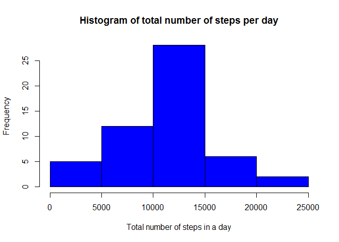
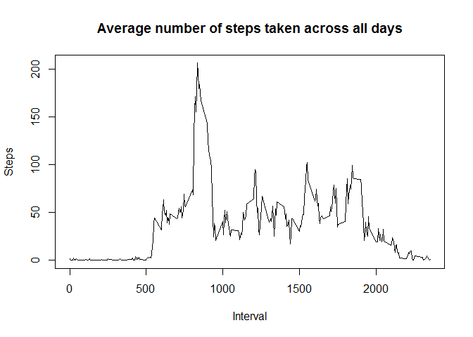
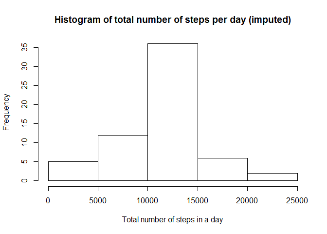
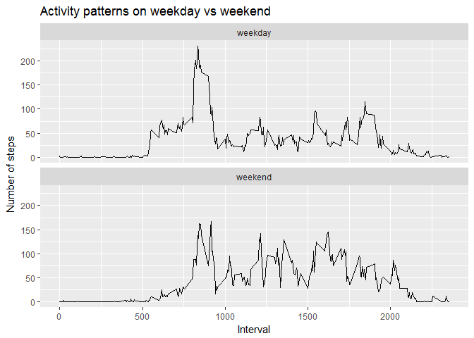

# PA1_template.Rmd
Adina Ivanica  
June 13, 2017  

Reproducible Research: Peer Assessment 1 - Week 2
=================================================

##Loading and preprocessing the data


         1. Load the data (i.e. read.csv())
        

```r
        setwd("D:/Coursera/Reproducible Research/Week2/Project")
        activMonitData <- read.csv ("activity.csv", header = T, sep = ",", stringsAsFactors = F)
```
         
         2. Process/transform the data (if necessary) into a format suitable for your analysis 
         

```r
        activMonitData$date <- as.Date(activMonitData$date, "%Y-%m-%d")
```


##What is mean total number of steps taken per day?


```r
        library (dplyr)
        library(ggplot2)
```

         1. Calculate the total number of steps taken per day
 

```r
        totStepsDay <- activMonitData %>% group_by(date) %>% summarize(total.steps = sum(steps, na.rm = T))
        totStepsDay
```

```
## # A tibble: 61 × 2
##          date total.steps
##        <date>       <int>
## 1  2012-10-01           0
## 2  2012-10-02         126
## 3  2012-10-03       11352
## 4  2012-10-04       12116
## 5  2012-10-05       13294
## 6  2012-10-06       15420
## 7  2012-10-07       11015
## 8  2012-10-08           0
## 9  2012-10-09       12811
## 10 2012-10-10        9900
## # ... with 51 more rows
```

         2. Make a histogram of the total number of steps taken each day        
         

```r
        avgDay <- aggregate(steps ~ date, FUN=sum, data=activMonitData)
        vtAvgDay <- activMonitData$steps
        names(vtAvgDay) <- activMonitData$date 
        
        hist(avgDay$steps, main="Histogram of total number of steps per day", xlab="Total number of steps in a day", col="blue")
```

<!-- -->

         3. Calculate and report the mean and median of the total number of steps taken per day

```r
        cMean <- (mean(avgDay$steps))
        cMedian <- factor(median(avgDay$steps))

        print(cMean)
```

```
## [1] 10766.19
```

```r
        print(cMedian)
```

```
## [1] 10765
## Levels: 10765
```


##What is the average daily activity pattern?


         1. Make a time series plot (i.e. type = "l") of the 5-minute interval (x-axis) and the average number of steps taken, averaged across all days (y-axis)


```r
        aggregInt <- aggregate(steps ~ interval, FUN=mean, data=activMonitData)

        plot(x=aggregInt$interval, y=aggregInt$steps, type="l", main="Average number of steps taken across all days", xlab="Interval", ylab="Steps")
```

<!-- -->

         2. Which 5-minute interval, on average across all the days in the dataset, contains the maximum number of steps?


```r
        maxStepsRow <- which.max(aggregInt$steps)
        # find interval with this max
        aggregInt[maxStepsRow, ]
```

```
##     interval    steps
## 104      835 206.1698
```


##Imputing missing values


         1.Calculate and report the total number of missing values in the dataset (i.e. the total number of rows with NAs)


```r
        totMissVal <- sum(is.na(activMonitData$steps))
        print(totMissVal)
```

```
## [1] 2304
```

         2. Devise a strategy for filling in all of the missing values in the dataset. The strategy does not need to be                      sophisticated. For example, you could use the mean/median for that day, or the mean for that 5-minute interval, etc.


```r
        dataInput <- activMonitData
        for (i in 1:nrow(dataInput)) {
          if (is.na(dataInput$steps[i])) {
            intVal <- dataInput$interval[i]
            stepVal <- aggregInt[
              aggregInt$interval == intVal,]
            dataInput$steps[i] <- stepVal$steps
          }
        }
```

         3. Create a new dataset that is equal to the original dataset but with the missing data filled in.


```r
        dataInputbyDay <- aggregate(steps ~ date, dataInput, sum)
        head(dataInputbyDay)
```

```
##         date    steps
## 1 2012-10-01 10766.19
## 2 2012-10-02   126.00
## 3 2012-10-03 11352.00
## 4 2012-10-04 12116.00
## 5 2012-10-05 13294.00
## 6 2012-10-06 15420.00
```
         4. Make a histogram of the total number of steps taken each day and Calculate and report the mean and median total number           of steps taken per day. Do these values differ from the estimates from the first part of the assignment? What is the impact          of imputing missing data on the estimates of the total daily number of steps?


```r
        hist(dataInputbyDay$steps, main="Histogram of total number of steps per day (imputed)", 
     xlab="Total number of steps in a day")
```

<!-- -->

```r
        mean(dataInputbyDay$steps)
```

```
## [1] 10766.19
```

```r
        median(dataInputbyDay$steps)
```

```
## [1] 10766.19
```

```r
        # get mean and median of data without NA's
        mean(avgDay$steps)
```

```
## [1] 10766.19
```

```r
        median(avgDay$steps)
```

```
## [1] 10765
```

###The mean values stay the same but there is a slight difference in the meadian value.

##Are there differences in activity patterns between weekdays and weekends?

        1. Create a new factor variable in the dataset with two levels - "weekday" and "weekend" indicating whether a given date is a weekday or weekend day.
        

```r
        dataInput['dayType'] <- weekdays(as.Date(dataInput$date))
        dataInput$dayType[dataInput$dayType  %in% c('Saturday','Sunday') ] <- "weekend"
        dataInput$dayType[dataInput$dayType != "weekend"] <- "weekday"
```

        2. Make a panel plot containing a time series plot (i.e. type = "l") of the 5-minute interval (x-axis) and the average number of steps taken, averaged across all weekday days or weekend days (y-axis). See the README file in the GitHub repository to see an example of what this plot should look like using simulated data.
        

```r
        dataInput$dayType <- as.factor(dataInput$dayType)

        # calculate average steps by interval across all days
        dataInputStepInt <- aggregate(steps ~ interval + dayType, dataInput, mean)
     
        qplot(interval, 
              steps, 
              data = dataInputStepInt, 
              geom=c("line"),
              xlab = "Interval", 
              ylab = "Number of steps", 
              main = "Activity patterns on weekday vs weekend") +
          facet_wrap(~ dayType, ncol = 1)
```

<!-- -->
